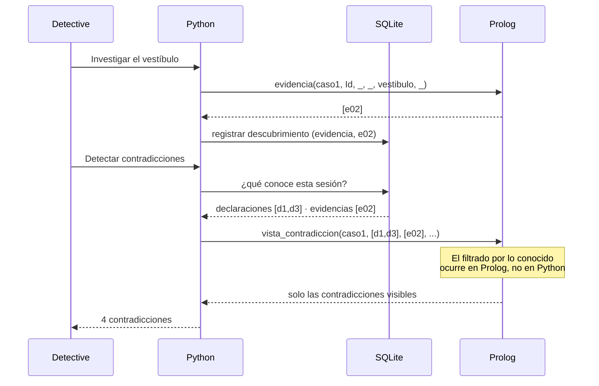

# Arquitectura de Logic Detective

## 1. Visión general

Tres componentes, tal como pide el enunciado: módulo de investigación, módulo
administrativo y motor de inferencia en Prolog.

```mermaid
graph TB
    subgraph navegador["Navegador"]
        UI["Módulo de Investigación<br/>14 secciones · 16 acciones"]
        ADM["Módulo Administrativo<br/>CRUD de casos"]
    end

    subgraph contenedor["Contenedor Docker"]
        subgraph python["Python — FastAPI"]
            ROUT["Routers<br/>web · api · admin"]
            SERV["Servicios<br/>investigacion · admin"]
            ENG["Puente Prolog<br/>engine.py"]
            DB[("SQLite<br/>sesiones · bitácora<br/>descubrimientos")]
        end

        subgraph prolog["SWI-Prolog"]
            JSON["api_json.pl<br/>serialización"]
            VIS["vistas.pl<br/>redacción"]
            CORE["motor · contradicciones<br/>sospecha · explicacion"]
            KB[("casos/*.pl<br/>3 bases de conocimiento")]
        end
    end

    UI --> ROUT
    ADM --> ROUT
    ROUT --> SERV
    SERV --> ENG
    SERV <--> DB
    ENG -->|"consulta_json/3"| JSON
    JSON --> VIS
    VIS --> CORE
    CORE --> KB

    style prolog fill:#3b3016,stroke:#d9a441
    style python fill:#1a1f29,stroke:#2e3644
```



## 2. La frontera Python / Prolog

Es la decisión de diseño más importante del proyecto, porque el enunciado
prohíbe explícitamente sustituir la deducción por condiciones en Python.

| Responsabilidad | Dónde vive |
|---|---|
| Determinar acceso, oportunidad, motivo, medios | **Prolog** |
| Validar o refutar coartadas | **Prolog** |
| Detectar contradicciones y mentiras | **Prolog** |
| Calcular el nivel de sospecha | **Prolog** |
| Deducir cómplices y responsable | **Prolog** |
| Redactar la explicación de cada regla | **Prolog** (`vistas.pl`) |
| Filtrar por lo que el usuario ha descubierto | **Prolog** (recibe las listas) |
| Recordar qué descubrió el usuario | Python / SQLite |
| Decidir *cuándo* preguntar y *qué* preguntar | Python |
| Registrar la bitácora | Python / SQLite |
| Renderizar HTML | Python / Jinja2 |

**Regla práctica:** si un `if` de Python decidiera algo sobre culpabilidad,
validez o contradicción, estaría en el lado equivocado de la frontera.

El caso frontera más tentador es el **nivel de sospecha**: sumar los puntos en
Python habría sido trivial. Se calcula en Prolog con `findall/3` y
`suma_lista/3` recursivo (`prolog/core/sospecha.pl`).

## 3. El puente: dos backends intercambiables

`app/prolog/engine.py` define un contrato único con dos implementaciones:

| | `PySwipBackend` | `SubprocessBackend` |
|---|---|---|
| Mecanismo | SWI-Prolog embebido por ctypes | Un proceso `swipl` por consulta |
| Velocidad | Suite completa en ~2 s | Suite completa en ~30 s |
| Seguridad entre hilos | No — requiere lock | Sí, por construcción |
| Riesgo | Falla si `libswipl.so` no carga | Ninguno relevante |
| Uso | Principal (lo exige la rúbrica) | Respaldo automático |

Con `LD_PROLOG_BACKEND=auto` (por defecto) se intenta PySwip y, si su
biblioteca nativa no carga, se degrada al subproceso dejando constancia en el
log. **Se pierde velocidad, no funcionalidad.**

Ambos delegan la serialización en `consulta_json/3`, así que devuelven
exactamente la misma estructura y el cambio de backend es invisible para el
resto de la aplicación. Lo verifica `test_28`.

### Concurrencia

PySwip embebe **un único intérprete** de SWI-Prolog en el proceso y no es
seguro entre hilos. Por eso:

1. Todas las consultas se serializan con un `threading.Lock` global.
2. El servidor corre con **un solo worker** de Uvicorn (fijado en el `CMD` del
   `Dockerfile`).

Para tres casos con unas decenas de hechos, serializar las consultas no tiene
costo perceptible.

### Trampa documentada: los corchetes del nombre del repositorio

El nombre que exige el curso, `[IA1]Proyecto1_GRUPO6_2S2026_SECA`, contiene
corchetes, que son **metacaracteres de glob** para SWI-Prolog: `[IA1]` es una
clase de caracteres.

`consult/1` expande su argumento con `expand_file_name/2`. Con la ruta absoluta
del proyecto, esa expansión devuelve la lista vacía — y consultar una lista
vacía de archivos **tiene éxito sin cargar nada**. El síntoma es
desconcertante: `consult` no falla, pero después ningún predicado existe.

Soluciones aplicadas:

- **Subproceso:** se ejecuta `swipl` con `cwd` en `prolog/` y se consulta por
  nombre relativo.
- **PySwip:** se usa `working_directory/2`, que resuelve la ruta sin expansión
  de comodines, y luego se consulta por nombre relativo. Un `os.chdir()` de
  Python no sirve: SWI-Prolog mantiene su propio directorio de trabajo.
- **Verificación explícita** tras el `consult`: si `consulta_json/3` no existe,
  se falla al arrancar en vez de en la primera petición del usuario.

## 4. Descubrimiento progresivo

El enunciado exige que el usuario descubra la información gradualmente. La base
de conocimiento contiene la verdad completa desde el inicio, así que hay que
separar dos cosas:

- **La verdad del caso** → los archivos `.pl`, inmutables durante la partida.
- **Lo que el usuario sabe** → tabla `descubrimientos` en SQLite, por sesión.



**Por qué no se usa `assert`/`retract`:** modificar la KB compartida para
reflejar el progreso corrompería el estado entre sesiones concurrentes. Dos
detectives jugando a la vez se pisarían. En su lugar, las listas de elementos
descubiertos viajan **como argumento** a los predicados de Prolog.

## 5. Modelo de datos

### Base de conocimiento (Prolog)

Todo hecho lleva el identificador del caso como primer argumento, lo que
permite tener las tres KB cargadas a la vez sin colisión de nombres y hace que
el motor sea genérico. El esquema completo está en `prolog/core/esquema.pl`.

Las horas se representan como enteros `HHMM` (`2130` = 21:30), lo que permite
compararlas directamente con `>=`, `=<` y `<`.

### Estado de la partida (SQLite)

| Tabla | Contenido |
|---|---|
| `sesiones` | Una investigación: caso, estado, acusado, veredicto, pistas usadas |
| `descubrimientos` | `(sesión, tipo, referencia)` de cada elemento revelado |
| `bitacora` | Toda acción del usuario con marca de tiempo |

## 6. Estructura del repositorio

```
prolog/
├── logic_detective.pl        # Punto de entrada: carga todo
├── core/
│   ├── esquema.pl            # Declaraciones dynamic/multifile/discontiguous
│   ├── utils.pl              # Listas y recursividad
│   ├── motor.pl              # Acceso, oportunidad, motivo, medios, coartadas
│   ├── contradicciones.pl    # Contradicciones e información falsa
│   ├── sospecha.pl           # Puntaje, cómplices, responsable
│   ├── explicacion.pl        # Catálogo de reglas, informe, pistas
│   ├── vistas.pl             # Redacción en español para la interfaz
│   └── api_json.pl           # Serialización JSON (frontera con Python)
└── casos/
    ├── caso1_louvre.pl       # Fácil
    ├── caso2_whitechapel.pl  # Medio
    └── caso3_rasputin.pl     # Difícil

app/
├── main.py                   # FastAPI, ciclo de vida, manejo de errores
├── config.py                 # Configuración por variables de entorno
├── templates_env.py          # Entorno Jinja2 compartido
├── prolog/engine.py          # Puente con los dos backends
├── services/
│   ├── investigacion.py      # Acciones del detective
│   └── admin.py              # CRUD de casos
├── routers/                  # web · api · admin
├── storage/db.py             # SQLite
├── templates/                # Jinja2
└── static/estilo.css

tests/                        # 86 pruebas
docs/                         # Esta documentación
```

## 7. Suposición pendiente de confirmar

El enunciado menciona el módulo administrativo como uno de los tres
componentes, pero **la sección que debería describirlo (página 6 del PDF)
contiene por error el texto del motor de inferencia**. El alcance del módulo
administrativo nunca llega a especificarse.

Ante esa ambigüedad se implementó la interpretación razonable: gestión del
ciclo de vida de los casos — consultar, validar contra los mínimos, crear a
partir de plantilla, editar con validación sintáctica, exportar y eliminar con
respaldo — más la supervisión del historial de sesiones.

**Conviene confirmarlo con el tutor.**
