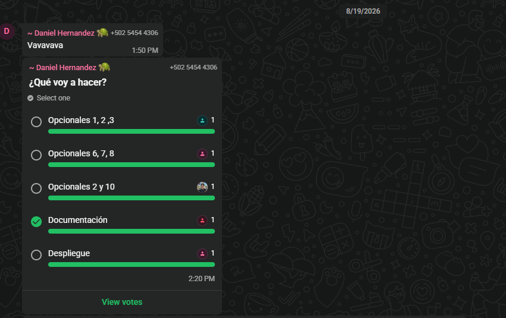
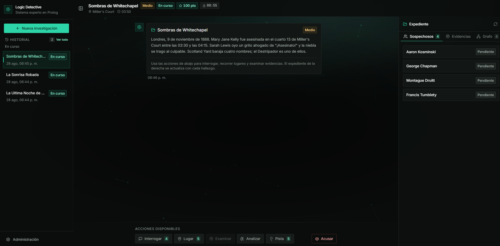
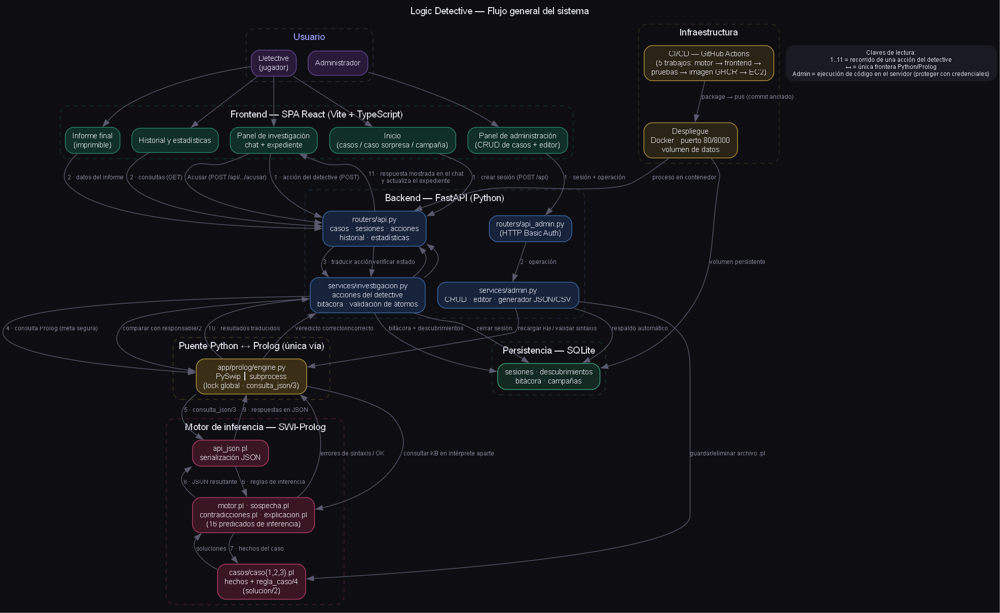

# Reporte de División de Trabajo — Logic Detective

**Universidad de San Carlos de Guatemala** · Facultad de Ingeniería
**Inteligencia Artificial 1 — Sección A** · **Proyecto 1, 2S2026** · **Grupo 6**

> Resumen de cómo se organizó el grupo del proyecto **Logic Detective** (sistema
> experto en Prolog para resolver casos de investigación), qué hizo cada
> integrante y con qué resultados quedó el trabajo. Las capturas de las
> reuniones acompañan este documento como respaldo.

---

## 1. El equipo

| # | Carné | Nombre | Área principal |
|---|---|---|---|
| 1 | **202300512** | Daniel Andree Hernandez Flores | Despliegue y frontend |
| 2 | **201905741** | Angel Geovanny Ordón Colchaj | Motor de inferencia en Prolog y coordinación |
| 3 | **202113580** | Andrés Alejandro Agosto Méndez | Documentación y manuales |
| 4 | **202300539** | Jose Emanuel Monzon Lemus | Grafo, informe PDF e historial |
| 5 | **202010040** | Evelio Marcos Josué Cruz Soliz | Estructura inicial, caso aleatorio, puntuación y temporizador |

---

## 2. Cómo trabajamos

El grupo trabajó sobre una base común, cada quien en su área para no pisarse.
La regla era sencilla: *quien toma un módulo, responde por él hasta la
entrega*. La comunicación fue diaria por el chat del grupo y, aparte, nos
reunimos cuatro veces:

| Fecha | Qué se hizo en la reunión |
|---|---|
| 13/08/2026 | Lectura del enunciado, repartición de las cinco áreas del proyecto |
| 16/08/2026 | Definición de los tres casos y del motor, avances de backend y frontend |
| 20/08/2026 | Reparto del alcance opcional: quién se quedaba con cada funcionalidad |
| 26/08/2026 | Cierre virtual: revisión del avance, documentación y plan de entrega |

Las decisiones de alcance (cuántas funcionalidades extra hacer y quién tomaba
cada una) se votaron con una **encuesta en el chat del grupo**, y el acuerdo
quedó anotado para constancia.

Los cinco integrantes participaron de principio a fin: en las reuniones, en
las votaciones y en las tareas asignadas. El trabajo de cada uno quedó
identificado en los registros del proyecto con su carné, como se detalla en la
siguiente sección.

---

## 3. Qué hizo cada integrante

### Daniel Andree Hernandez Flores — 202300512 · Despliegue

Daniel se encargó de que el proyecto **se viera y funcionara**. Por un lado
armó la interfaz: las pantallas, la paleta de colores y el flujo de la
aplicación. Por otro lado dejó el sistema listo para ponerse en marcha:
empaquetado en un contenedor, con su configuración de despliegue y con
verificación automática de que todo siga funcionando al integrar cambios.
También se encargó de unir el trabajo de todos los integrantes y de resolver
los conflictos que iban saliendo en el camino.

### Angel Geovanny Ordón Colchaj — 201905741 · Motor Prolog y coordinación

Angel fue el coordinador del grupo y el que construyó el **cerebro del
sistema**: el motor de inferencia en Prolog que deduce acceso, oportunidad,
motivos, contradicciones, nivel de sospecha y al responsable de cada caso,
con sus pruebas. También implementó el **modo multicaso con estadísticas**
(las campañas que recorren los casos en orden de dificultad), la puntuación
por consultas y la verificación automática del proyecto. Al final fue quien
más integró el trabajo de los demás.

### Andrés Alejandro Agosto Méndez — 202113580 · Documentación

A Andrés le tocó que todo quedara **explicado y con evidencia**. Escribió los
manuales de la entrega (el Manual de Usuario y el Manual Técnico) y armó en
`documentacion/` el resto del material del proyecto. De paso también colaboró
en la integración entre Python y Prolog sobre la que corre toda la aplicación.

### Jose Emanuel Monzon Lemus — 202300539 · Grafo, PDF e historial

Jose se quedó con las funciones que más se ven en la interfaz. Hizo el
**grafo interactivo de sospechosos y evidencias**, la **exportación del
informe final a PDF** y el **historial de investigaciones** con filtros por
caso y veredicto y sus estadísticas de resolución. También ayudó en la
definición inicial de los tres casos del sistema.

### Evelio Marcos Josué Cruz Soliz — 202010040 · Estructura y partida

Evelio puso la base del proyecto y los detalles de la **experiencia de
partida**: el **caso sorpresa** (el sistema elige el caso al azar), la
**puntuación por consultas** (cada acción resta puntos) y el **temporizador**
(se mide la duración de la investigación). Revisó también la parte de
infraestructura antes de que se integrara.

---

## 4. Notas para la defensa

Cada integrante explica su propia área el día de la defensa:

- **Daniel:** cómo queda empaquetado y puesto en marcha el sistema, y la
  interfaz que construyó.
- **Angel:** el motor Prolog y el modo multicaso: cómo deduce al responsable,
  por qué algo que no se puede probar se toma como falso, qué evita cada corte
  y cómo elige el siguiente caso.
- **Andrés:** la documentación y la comunicación entre Python y Prolog: por qué
  Python nunca decide culpabilidad y cómo funciona el descubrimiento
  progresivo.
- **Jose:** el grafo, el PDF y el historial: cómo se visualizan los
  sospechosos y evidencias, cómo se imprime el informe y qué filtros ofrece el
  historial.
- **Evelio:** el caso aleatorio, la puntuación y el temporizador: cómo se
  registran las acciones y de dónde sale cada métrica.